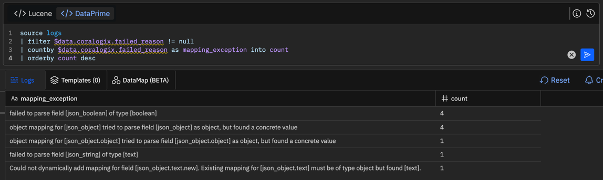

[SPDX-License-Identifier: CC-BY-SA-4.0]: #
[Copyright © 2024 Sven Lange-Last]: #
# Log Record Field Types and Mapping Exceptions in IBM Cloud Logs Priority Insights

TODO: Should split this article up into 3 articles:

1. Log record field types
2. Mapping exceptions and how to resolve
3. Tutorial with log record examples

The Priority insights feature in IBM Cloud Logs parses log records into typed fields. Mapping exceptions in Priority insights occur when a log record field has a value that does not match the orginally determined type. In such a case, Priority insights only stores the information of the full log record as text but not the individual fields. At first glance it looks like log records are missing. They are there, but are not found by data field-based filters and queries.

This article explains:

* how Priority insights detects new fields and determines their type.
* what causes mapping exceptions.
* how to identify which log records are affected by which mapping exceptions.
* how to resolve mapping exceptions.

The Priority insights feature is based on the [OpenSearch Project](https://opensearch.org/). If you already know OpenSearch, the concepts will sound familiar to you.

What is important to know: The Store and search feature in IBM Cloud Logs works differently than Priority insights. Store and search uses dynamic types and is not affected by mapping exceptions. If you miss log records in Priority insights queries, use the same query in "All Logs" on the "Logs" page or submit it on the "Archive query" page. The Store and search feature requires that you connect an IBM Cloud Object Storage (COS) bucket to your IBM Cloud Logs service instance.

## Parsing log records into fields

Log records sent to IBM Cloud Logs can be text in many different formats: [JSON](https://www.json.org/), [logfmt](https://brandur.org/logfmt), [Extended Log File Format](https://www.w3.org/TR/WD-logfile.html), [Syslog](https://datatracker.ietf.org/doc/html/rfc5424), [Common Log Format](https://en.wikipedia.org/wiki/Common_Log_Format), [HAProxy log formats](https://www.haproxy.com/documentation/haproxy-configuration-manual/1-8r1/#8), ... or any text that does not follow a known format.

If a log record is in JSON format, its JSON members are parsed into named fields together with their contents. Example: `{ "key": "value" }` is parsed into a field named `key` with content `value`.

If a log record is NOT in JSON format or mixed with non-JSON data like a timestamp at the beginning of the log record, parsing rules can be used in IBM Cloud Logs to transform the log record into JSON format that can be parsed. Parsing rules can also be used to extract portions of the log record into named fields.

The result of parsing rules and parsing: The log record is indexed (stored) in Priority insights as a set of fields and their contents.

(For completeness: When a log record is stored in Priority insights, it is also stored in Store and search if a COS bucket is connected, i.e. it is stored in two places in parallel.)

## What happens when a new field is detected?

Priority insights keeps track of all known fields in its index. When a log record is processed, Priority insights checks whether the field names are already known. For an unknown field, a field mapping is added to the index that determines the field type plus other instructions how to index the field.

The field mapping depends on the field value and the field name. You may wonder why it depends on the field name. IBM Cloud Logs allows users to select some special field types based on the field name suffix because the field value would not be sufficient to safely detect the desired type. Example: If a field name ends with `_ipaddr`, its type is IP address. Without this name suffix, IP address values are classified as type text.

The table below shows the different field mappings in Priority insights at the time of writing this article. When a new field is detected, Priority insights evaluates field mapping matching conditions from top to bottom. The first field mapping that matches the new field is added to the index.

Rank | Field value has type | Field name ends with | Resulting field type | Multifields | Example values
--- | --- | --- | --- | --- | ---
1 | Any | `_geopoint` | [`geo_point`](https://opensearch.org/docs/latest/field-types/supported-field-types/geo-point/) | `keyword` with type [`keyword`](https://opensearch.org/docs/latest/field-types/supported-field-types/keyword/) | `"location_geopoint": { "lat": 48.666234, "lon": 9.0366981 }`
2 | `object` | Any | [`object`](https://opensearch.org/docs/latest/field-types/supported-field-types/object/) | None | `"new": { "key": "value" }`<br/>`"new": { }`
3 | `boolean` | Any | [`boolean`](https://opensearch.org/docs/latest/field-types/supported-field-types/boolean/) | `keyword` with type [`keyword`](https://opensearch.org/docs/latest/field-types/supported-field-types/keyword/) | `"new": true`<br/>`"new": false`
4 | Any | `_ipaddr` | [`ip`](https://opensearch.org/docs/latest/field-types/supported-field-types/ip/) | `keyword` with type [`keyword`](https://opensearch.org/docs/latest/field-types/supported-field-types/keyword/) | `"server_ipaddr": "203.0.113.42"`
5 | Any | `_custom_timestamp` | [`date`](https://opensearch.org/docs/latest/field-types/supported-field-types/date/) | `numeric` with type [`scaled_float`](https://opensearch.org/docs/latest/field-types/supported-field-types/numeric/)<br/>`keyword` with type [`keyword`](https://opensearch.org/docs/latest/field-types/supported-field-types/keyword/) | `"start_custom_timestamp": "2024-09-17T16:39:30"`<br/>`"start_custom_timestamp": "1726591170"`
6 | Any | Any | [`text`](https://opensearch.org/docs/latest/field-types/supported-field-types/text/) | `numeric` with type [`scaled_float`](https://opensearch.org/docs/latest/field-types/supported-field-types/numeric/)<br/>`keyword` with type [`keyword`](https://opensearch.org/docs/latest/field-types/supported-field-types/keyword/) | `"new": "This is a text."`<br/>`"new": "true"`<br/>`"new": 42`<br/>`"new": "48.666234,9.0366981"`<br/>`"new": "203.0.113.42"`<br/>`"new": "2024-09-17T16:39:30"`

## What are multifields?

[Multifields](https://opensearch.org/docs/latest/field-types/supported-field-types/index/#multifields) are used to index the same field differently. Example: Field `"json_number_integer": 42` is stored as

* `text` field named `json_number_integer`. It can be queried with Lucene query `json_number_integer:"42"` and DataPrime query `source logs | filter $d.json_number_integer ~ '42'`.
* `scaled_float` field named `json_number_integer.numeric`. It can be queried with Lucene query `json_number_integer.numeric:[42 TO 42]`. DataPrime does not fully recognize the `json_number_integer.numeric` field. For this reason, DataPrime queries use type conversion instead of subfield `source logs | filter $d.json_number_integer:number == 42`.
* `keyword` field named `json_number_integer.keyword`. It can be queried with Lucene query `json_number_integer.keyword:"42"` and DataPrime query `source logs | filter $d.json_number_integer.keyword ~ '42'`.

## Why different types?

Different field types in Priority insights support different Lucene query types. Following table shows examples which Lucene query types work well for different field types.

Field type | Lucene query type | Example field | Matching example query | 
--- | --- | --- | ---
`ip` | CIDR query | `"json_ipaddr": "203.0.113.42"` | `json_ipaddr:"203.0.113.0/24"`
`date` | Range query | `"json_custom_timestamp": "1726591170"` | `json_custom_timestamp:[1726591170\|\|-1m TO 1726591170\|\|+1h]`
`text` | Term query | `"json_string": "This is a text."` | `json_string:a text this is`
`text` | Fuzzy term query | `"json_string": "This is a text."` | `json_string:ex~2`
`text` | Wildcard query | `"json_string": "This is a text."` | `json_string:(te* i?)`
`text` | Range query | `"json_string": "This is a text."` | `json_string:>=th`
`keyword` | Phrase query | `"json_string": "This is a text."` | `json_string.keyword:"This is a text."`
`keyword` | Regular expression query | `"json_string": "This is a text."` | `json_string.keyword:/This [si]+ a.*/`
`keyword` | Range query | `"json_string": "This is a text."` | `json_string.keyword:["This is" TO "This will"]`
`scaled_float` | Term query | `"json_number_integer": 42` | `json_number_integer.numeric:42`
`scaled_float` | Range query | `"json_number_integer": 42` | `json_number_integer.numeric:[42 TO *]`

The main difference between `text` and `keyword` fields in Priority insights:

* `text` field values are analyzed and stored as tokens. When searching text fields, you can search for tokens in any order. Example: Lucene query `json_string:a text this is` matches a log record that contains `"json_string": "This is a text."`.
* `keyword` field values are not analyzed but only normalized to lower case and leading / trailing whitespace is removed. When searching keyword fields, you can only search exact matches. Examples: Lucene query `json_string.keyword:"this is a text."` matches a log record that contains `"json_string": "This is a text."`. Lucene queries `json_string.keyword:"this is a text"` (`.` missing at the end), `json_string.keyword:this is a text.` (without enclosing search term in `"`) and `json_string:a text this is` do not match the log record.

More details can be found here:

* [OpenSearch documentation: Query string query](https://opensearch.org/docs/latest/query-dsl/full-text/query-string)
* [Apache Lucene documentation: Classic query syntax](https://lucene.apache.org/core/9_11_1/queryparser/org/apache/lucene/queryparser/classic/package-summary.html#package.description)

## Ignoring malformed values

The field mappings for types `geo_point`, `ip`, and `date` ignore malformed values. Example: The value `This is a text.` is no valid `geo_point`, `ip`, or `date` value - i.e. it is malformed for said types. When a log record contains a `geo_point`, `ip`, or `date` field with a malformed value, that log record field value will be stored in Priority insights but won't be indexed - other log record field values will be indexed. Field values that are not indexed cannot be found in field searches. Example: A log record containing `"server_ipaddr": "This is a text."` won't be returned by Lucene query `server_ipaddr:"This is a text."` or DataPrime query `source logs | filter $d.server_ipaddr == 'This is a text.'` in Priority insights. (With Store and search, i.e. when selecting "All logs", the queries will return the log record.)

Following queries return all log records that contain ignored fields:

* Lucene: `_exists_:_ignored`
* DataPrime: `source logs | filter $d._ignored == null`

See Elasticsearch documentation for details: [ignore_malformed](https://www.elastic.co/guide/en/elasticsearch/reference/current/ignore-malformed.html) and [The antidote for index mapping exceptions: ignore_malformed](https://www.elastic.co/observability-labs/blog/antidote-index-mapping-exceptions-ignore-malformed).

## What about arrays?

In Priority insights, a log record field with JSON array value is stored as a field with multiple values. What is important: All values in the array must have the same type. Example: Field `"json_number_integer": [23, 42]` is stored as `text` field with two values, i.e. `23` and `42`.

There is no explicit [array](https://opensearch.org/docs/latest/field-types/supported-field-types/index/#arrays) type. When a new field is detected, a field mapping is added to the index based on value and it doesn't make a difference whether its a single value or multiple values in a JSON array. Example: Both, `"json_number_integer": 42` and `"json_number_integer": [23, 42]` create exactly the same field mapping.

## What about `null` values?

JSON has the `null` value which stands for the empty value. When Priority insights detects a new field with value `null`, an empty array (`[]`), or an array that only contain `null` values (`[ null, ... ]`), it does not add a field mapping to the index, i.e. the field stays unknown.

It is not possible to search for `null` values in Lucene queries.

See [OpenSearch documentation: Null value](https://opensearch.org/docs/latest/field-types/supported-field-types/index/#null-value).

## What about nested objects?

In Priority insights, a log record field with JSON object value is stored in the index as an `object` field. Similar to a JSON object, an `object` field contains an unordered set of sub-fields with values. Any JSON member in a JSON object creates a sub-field based on member's value. In queries, a sub-field is referenced by using a path expression with dots (`.`).

Example: When a log record contains `"json_object": { "json_boolean": true, "json_string": "This is a text." }`, Priority insights will create three fields:

1. An `object` field named `json_object`.
2. A `boolean` field named `json_boolean` as sub-field of `json_object`. In queries, this field can be referenced as `json_object.json_boolean`.
3. A `text` field named `json_string` as sub-field of `json_object`. In queries, this field can be referenced as `json_object.json_string`.

In the example, field `json_object` has two sub-fields. Future log records with the `json_object` field need NOT contain these two sub-fields. Future log records may contain none, one, or both of these sub-fields as well as different sub-fields.

In Priority insights, sub-fields of an `object` field can also have type `object`. As a result, `object` fields can be nested to (almost) any depth. [Path expressions](https://en.wikipedia.org/wiki/Path_expression) with dots (`.`) are used to reference nested fields in queries. Example: `"an": {"object": {"nested:" {"in": {"an": "object"} } } }`. In this example, the innermost field named `an` is a `text` field and can be referenced as `an.object.nested.in.an`. All other fields are `object` fields.

## What about dots in field names?

As mentioned above, Priority insights supports nested `object` fields and path expressions with dots (`.`) are used to reference nested fields in queries. But what if log records contain fields with dots? Example: `"an.object.nested.in.an": "object"`.

Imagine Priority insights received a log record with following content (Spoiler: It wouldn't work.): `{ "an.object.nested.in.an": "object","an": {"object": {"nested:" {"in": {"an": "object"} } } } }`. In queries, the both fields would be referenced as `an.object.nested.in.an`. This is obviously a problem. 

In order to avoid said problem, Priority insights interpretes field names containing dots as path expressions. Such field names are expanded as nested objects. Example: `"an.object.nested.in.an": "object"` is interpreted as `"an": {"object": {"nested:" {"in": {"an": "object"} } } }`. With this approach, path expressions in field names have the same meaning when ingesting and when querying.

See [Allowing dots in field names #15951](https://github.com/elastic/elasticsearch/issues/15951) for details.

## Challenges with dots in field names

Log records may contain field names with dots without being path expressions describing nested objects. Example: [Kubernetes Recommended Labels](https://kubernetes.io/docs/concepts/overview/working-with-objects/common-labels/) or [Kubernetes Well-Known Labels, Annotations and Taints](https://kubernetes.io/docs/reference/labels-annotations-taints/) contain dots (`.`). Widely used labels are `app.kubernetes.io/name`, `app.kubernetes.io/version`, `kubernetes.io/os`. Log collectors may add these labels and their values to log records when tailing container logs in a Kubernetes cluster.

When Priority insights processes a log record with field `"app.kubernetes.io/name": "test"`, it will be added to the index as `"app": { "kubernetes": { "io/name": "test" } }` - i.e. `object` fields `app` and `kubernetes` as well as `text` field `io/name`. Most users would have expected a single `text` field named `app.kubernetes.io/name`.

I'm going to discuss below why field names with dots can cause mapping exceptions in Priority insights.

## Priority insights index lifecycle

Priority insights processes log records and stores them in the index as a set of fields and their contents. All fields have a field mapping in the index that determines the field type plus other instructions how to index the field.

Each IBM Cloud Logs service instance has a separate set of Priority insights indices. The first index in the set is created when the service instance is created. Every day at 00:00 UTC, a new index is created and added to the set. At the same time, the oldest index is removed if it has reached its expiration date. After creation, the new daily index does not contain any field mappings. Every day, the fields are learnt anew and new field mappings are added. Daily indices are independent of each other and a particular field name can have a different type every day.

Example:

* On day 1, log record `{ "a": "text", "b": {} }` is processed. New fields named `a` and `b` are detected. Field `a` is added to the index as `text` field. Field `b` is added to the index as `object` field.
* On day 2, a new index is started and log record `{ "a": "text", "b": "text" }` is processed. Fields `a` and `b` do not exist yet in the new index for day. They are detected as new fields. Fields `a` and `b` are added to the index as `text` fields.

In this example, field `b` was an `object` field on day 1 and a `text` field on day 2.

Queries in Priority insights work on the full set of indices that belong to the service instance - not only the current daily index.

The advantage of the daily index lifecycle: When you change field types in your log records, Priority insights may detect a type conflict on day 1 - but on day 2, it will start using the new type.

## What are mapping exceptions in Priority Insights?

As mentioned before, Priority insights parses log records into named fields. All these fields have a field mapping in the index that determines the field type plus other instructions how to index the field.

When Priority insights processes a log record, some of the fields in the log record will already have a field mapping in the current daily index and others may be unknown. For known fields, the field mapping defines the field type. It can happen that the value of a field in a new log record is not an allowed value for the type defined by the field mapping.

Example:

* The current daily index contains a field named `json_object` with type `object`.
* Priority insights processes a new log record with field `"json_object": "This is a text."`.
* Priority insights determines that the provided value `"This is a text."` is not a allowed value for an `object` field.
* Priority insights cannot index the log record with the given `json_object` field and value.

When Priority insights processes a log record, a new field maybe detected. Priority insights will add a new field mapping to the index based on name and value of the processed field. But for nested fields, it can happen that the new field mapping conflicts with an existing field mapping.

Example:

* The current daily index contains a field named `json_string` with type `text`.
* Priority insights processes a new log record with field `"json_string.new": "This is a text."`.
* Field name `json_string.new` is a path expression and stands for a nested object. So the field is expanded to `"json_string": { "new": "This is a text." }`.
* Priority insights detects that a field named `json_string` already exists in the daily index an tries to add `new` as a sub-field. This fails because only `object` fields can have sub-fields but the existing `json_string` field has type `text`.
* Priority insights cannot index the log record with the given `json_string.new` field and value.

In sections [What about dots in field names?](#what-about-dots-in-field-names) and [Challenges with dots in field names](#challenges-with-dots-in-field-names), I explained that field names with dots (`.`) will be interpreted as path expressions and will be expanded as nested objects. Log records may contain field names with dots that were never meant to be interpreted as path expressions. This can lead to a special case of a field mapping conflict with nested fields that is hard to spot.

Example:

* The current daily index contains a field named `kubernetes.labels.app` with type `text`.<br/>The IBM Cloud Logs Agent will add such a field to log records that were emitted by a container from a Kubernetes pod that has a label named `app`. Many Kubernetes workloads still use this label name because it was a de-facto standard label in the past and is still used in many Kubernetes examples. See [Kubernetes docs: Labels and Selectors](https://kubernetes.io/docs/concepts/overview/working-with-objects/labels).
* Priority insights processes a new log record with field `kubernetes.labels.app.kubernetes.io/name` with type `text`.<br/>The IBM Cloud Logs Agent will add such a field to log records that were emitted by a container from a Kubernetes pod that has a label named `app.kubernetes.io/name`. This is a [well-known](https://kubernetes.io/docs/reference/labels-annotations-taints/#app-kubernetes-io-name) and [recommended](https://kubernetes.io/docs/concepts/overview/working-with-objects/common-labels/#labels) Kubernetes label.
* Priority insights detects that a field named `kubernetes.labels.app` already exists in the daily index and tries to add `kubernetes` as a sub-field. This fails because only `object` fields can have sub-fields but the existing `kubernetes.labels.app` field has type `text`.
* Priority insights cannot index the log record with the given `kubernetes.labels.app.kubernetes.io/name` field and value.

When Priority insights is not able to index a field from a new log record because of malformed values or sub-field conflicts, this is a mapping exception.

For completeness: In section [Ignoring malformed values](#ignoring-malformed-values), I explained that fields may ignore malformed values. When a log record contains a field with a malformed value and that field is configured to ignore malformed values, that field won't be indexed for the log record and NO mapping exception will occur. The problem will be silently ignored.

What is important to know: The Store and search feature in IBM Cloud Logs works differently than Priority insights. Store and search uses dynamic types and is not affected by mapping exceptions. If you miss log records in Priority insights queries, use the same query in "All Logs" on the "Logs" page or submit it on the "Archive query" page. The Store and search feature requires that you connect an IBM Cloud Object Storage (COS) bucket to your IBM Cloud Logs service instance.

## What happens with a log record that has a mapping exception?

When a log record is affected by a mapping exception, Priority insights will do the following:

* The log record is NOT stored and indexed by Priority insights as-is.
* The original log record content is transformed into escaped [JSON](https://www.json.org/) and stored in field named `text` in a transformed log record. As a result, it does no longer have named fields but is a single text string.
* A field mapping exception message is added to the transformed log record using the `coralogix.failed_reason` field. This field can be queried to find log records that could not be stored and indexed as-is.
* The transformed log record is stored and indexed by Priority insights. As a result, full text search can still be performed - but no field searches.

Example:

* Priority insights processes a new log record with a single field: `{ "json_object": {} }`.
* Priority insights detects that `json_object` is a new field of type `object` and adds it to the daily index.
* Priority insights processes a new log record with a single field: `{ "json_object.object": "This is a text." }`.
* Priority insights detects that `json_object` is a known field of type `object`. The provided value `"This is a text."` is not an allowed value for this type.
* Priority insights wraps the full original log record as follows: `{ "text":"{\"json_object\":\"This is a text.\"}" }`. `json_object` is no longer a field in the log record, but only text. Full text searches will still work on the wrapped log record.
* Priority insights adds follwing field to the log record: `"coralogix.failed_reason": "object mapping for [json_object] tried to parse field [json_object] as object, but found a concrete value"`.
* Priority insights stores the transformed log record.

## Are log records affected by mapping exceptions returned by searches?

Following searches in Priority insights will return log records affected by mapping exceptions:

* Filters or queries on log records label fields like `Application` or `Subsystem`. In Lucene queries, such fields are prefixed with `coralogix.`. In DataPrime queries, such fields are prefixed with `$l.`.
* Filters or queries on log record metadata fields like `Severity` (`severity`). In Lucene queries, such fields are prefixed with `coralogix.`. In DataPrime queries, such fields are prefixed with `$m.`.
* Full text queries on log record data. Use Lucene queries like `"This is a text"`. Use Dataprime queries like `source logs | filter $d ~ 'This is a text'`.

All filters or queries on log record data fields will NOT return log records affected by mapping exceptions. In Lucene queries, these are all fields not prefixed with `coralogix.`. In DataPrime queries, such fields are prefixed with `$d.`.

## How can I determine whether log records are affected by mapping exceptions?

There are several approaches to determine whether log records are affected by mapping exceptions and which fields cause the mapping exceptions.

On the `Explore Logs` - `Logs` page, select `Priority Insights`. The `Logs` tab selector is followed by a number in parentheses (`(...)`) with the number of logs that are matched by the current filter / query combination. If that tab selector also contains an indicator symbol that looks like a filled crossed-out circle, the result list contains log records affected by mapping exceptions. If you hover the mouse pointer over the indicator symbol, Cloud Logs will display a help message.


On the `Explore Logs` - `Logs` page, select `Priority Insights` and the `Logs` tab. If the result list contains log records affected by mapping exceptions, you can add a result column named `!` (exclamation mark) which displays the contents of the `coralogix.failed_reason` field. For log records affected by mapping exceptions, the `!` columns will contain an indicator symbol that looks like a filled crossed-out circle. If you hover the mouse pointer over the indicator symbol, Cloud Logs will display the mapping exception message.

Select `Columns` to add `!` (exclamation mark) column.


Move the `!` (exclamation mark) column to `In Use` list.


Sample mapping exception message for a log record in `!` (exclamation mark) column.


Following DataPrime query can be used in Priority Insights to identify which field mapping exceptions occur how often. IBM Cloud Logs will display a result table. Resize the `mapping_exception` column to see the full exception messages.

```
source logs
| filter $data.coralogix.failed_reason != null
| countby $data.coralogix.failed_reason as mapping_exception into count
| orderby count desc
```



Following DataPrime query can be used in Priority Insights to list log records affected by a field mapping exception:

```
source logs
| filter $data.coralogix.failed_reason != null
| choose $data.text, $data.coralogix.failed_reason
```

Following DataPrime query can be used in Priority Insights to list log records that are affected by a particular mapping exception - replace `<failed_reason>` in `contains()` with the mapping exception message. The query returns the `text` field and the `coralogix.failed_reason` of matching log records.

```
source logs
| filter $data.coralogix.failed_reason.contains('<failed_reason>')
| choose $data.text, $data.coralogix.failed_reason
```

When creating parsing rules to address mapping exceptions, it is often useful to see log records with the field in question that are not affected by a mapping exception. Following DataPrime query can be used in Priority Insights to list such log records - replace `<field_name>` with the name of the field in question.

```
source logs
| filter $data.coralogix.failed_reason == null
| filter $data.<field_name> != null
| choose $data.<field_name>
```

## How do I read mapping exception messages?

Mapping exception messages always contain

* the field affected by the exception: `field [...]`. The squad brackets contain the field name.
* the exception reason.

The following table lists and explains typical mapping exception messages.

Mapping exception message | Explanation
--- | ---
`failed to parse field [<field-name>] of type [<type>]` | The log record contains a field `<field-name>`. The daily Priority insights index already contains a field with the type from the message. The field value in the log record is not an allowed value for the field type registered in the index.<br/>This message can occur with types `boolean` and `text`.
`object mapping for [<field-name>] tried to parse field [<field-name>] as object, but found a concrete value` | The log record contains a field `<field-name>`. The daily Priority insights index already contains an `object` field with that name. The field value in the log record is not an object.
`Could not dynamically add mapping for field [<field-name>.<sub-field-name>]. Existing mapping for [<field-name>] must be of type object but found [<type>].` | The log record contains a field `<field-name>.<sub-field-name>`. The daily Priority insights index already contains a field with name `<field-name>` which is not of type `object`. Said index does NOT contain a field with name `<field-name>.<sub-field-name>` yet. Priority insights wants to add field `<sub-field-name>` as a sub-field to the known field `<field-name>` which does not work because sub-fields can only be added to `object` fields.<br/>This message occurs most often if `<field-name>` is already known as `text` field.

## Mapping exceptions can vary from day to day

As mentioned before, Priority insights maintains a separate daily index for each Cloud Logs service instance. Every day a new daily index is created. After creation, the new daily index does not contain any field mappings. Every day, the fields are learnt anew and new field mappings are added. Daily indices are independent of each other and a particular field name can have a different type every day.

Mapping exceptions are caused by fields that have different types in different log records. The log record that has the first occurrence of a particular field `F` on a day determines the field type `T1` on this day. Other log records on that day may contain field `F` with type `T2`. On that day, log records where field `F` has type `T2` will be affected by a mapping exception. The next day, the first log record with field `F` could be one where field `F` has the type `T2`. On that day, log records where field `F` has type `T1` will be affected by a mapping exception. Mapping exceptions related to a particular field can vary from day to day.

Example:

* Some log records contain a field named `message` with values that Priority insights classifies as `text`.
* Other log records contain a field named `message` with object values, i.e. the `message` field has sub-fields.
* Priority insights stores known fields and their types in the daily index. Whether `message` is a `text` field or an `object` field in the daily index depends on which log record is processed first on a day:
* If `message` is indexed as a `text` field, log records that contain `message` as an `object` field will have following mapping exception message: `Could not dynamically add mapping for field [message...]. Existing mapping for [message] must be of type object but found [text].`.
* If `message` is indexed as a `object` field, log records that contain `message` as an `text` field will have following mapping exception message: `object mapping for [message] tried to parse field [message] as object, but found a concrete value`.

## How do I resolve mapping exceptions?

The generic answer is to ensure that all values of a particular log record field always have the same type in Priority insights. Once Priority insights has determined the type of a field and added it to a daily index, all following log records must only have allowed values for that type.

This can be done at different places with different approaches:

* Curate log messages / records emitted by applications such that a particular field always has the same type.
* Use filters in the IBM Cloud Logs Agent to transform field names or field values.
* Use parsing rules in IBM Cloud Logs to transform field names or field values.

This article focuses on parsing rules in IBM Cloud Logs.

What it is important:

* A log record may be affected by multiple mapping exceptions - but only one mapping exception message is available on an affected log record. After a mapping exception has been resolved, additional mapping exception messages may become visible. Resolving mapping exceptions is an iterative process.
* The approaches listed above only affect new log records. When you add a parsing rule to IBM Cloud Logs, it won't change log records that are already stored in Priority insights or Store and search. Log records already stored in Priority insights that were affected by a mapping exception before a parsing rule was added will still be affected by the same mapping exception after the parsing rule was added.
* The approaches listed above cannot change existing field mappings in the current daily Priority insights index. The current daily index may still contain undesired field mappings so that more log records to be stored in this index will be affected by mapping exceptions. You may have to wait for a new daily index to see the desired effect of the approaches listed above.<br/>Example: If you rename an `object` field to resolve a conflict with a `text` field, this field may still be an `object` field in existing indices. A new daily index is needed to reliably turn it into a `text` field.

## Use parsing rules in IBM Cloud Logs to resolve mapping exceptions

There are different techniques to resolve mapping exceptions with parsing rules in IBM Cloud Logs:

1. Change log record field name: Use a `Replace` parsing rule to detect a field with a value that has a conflicting type and rename the field.
2. Sanitize field names with dots: Use a `Replace` parsing rule to detect a field name with dots (`.`) and replace dots with `_`.
3. Hide complex nested field object structures: Use a `Stringify JSON field` parsing rule to rename a field with a complex JSON object value and turn the value into escaped JSON.

The following sections describe the techniques in more detail.

### Regular expressions in parsing rules

[Regular expressions](https://en.wikipedia.org/wiki/Regular_expression) play a central role in parsing rules. They are used to match, capture, and replace log record content. Parsing rules and regular expressions can operate on the full log record content (`Text`) or on detected fields. When changing field names, you should always work on full log record content.

Regular expressions in parsing rules work on raw log record content. Mapping exceptions can only occur if log record content is in [JSON](https://www.json.org/) format - otherwise Priority Insights won't detect fields and field types. For this reason, regular expressions in parsing rules for resolving mapping exceptions will always operate on content in JSON format. Knowledge of the JSON format can be used to "detect" field types in regular expressions. Examples: An JSON object value always starts with the `{` character, a JSON string value always starts with the `"` character, and a JSON number value always starts with a digit or the `-` character.

Always test regular expression matchers and replacement strings with a couple of sample raw log records. Use the approaches from section [How can I determine whether log records are affected by mapping exceptions?](#how-can-i-determine-whether-log-records-are-affected-by-mapping-exceptions) to identify sample log records for testing.

Use the following procedure to obtain a raw log record. On the `Explore Logs` - `Logs` page, the result list has a `#` column with consecutive number. Hover the mouse pointer over the number of the log record for which you want to obtain the raw content until it turns into three dots (`...`). Click the three dots to open a context menu and select `Open Info Panel`. In this panel, select option `RAW` and use the `Copy to clipboard` button.

Creating a proper regular expression can be challenging. You can use tools like https://regex101.com/ to create, test, and debug regular expressions as well as replacement strings.

After a parsing rule has been set up, check whether new log records look as expected and whether they are no longer affected by mapping exceptions.

### Technique 1: Change log record field name

Use a `Replace` parsing rule to detect a field with a value that has a conflicting type and rename the field. The regular expression used by the parsing rule needs to match the field name AND values with conflicting type so that the field name is only changed on the proper set of log records.

Problem: **`field` has JSON object and other JSON values**

* Solution: Rename from `field` to `field_obj` for JSON object values.
* Description: JSON object values always start with the `{` character. Capture field name as well as following content using `(...)` to build replacement string.
* Regular expression: `"(field)"(\s*:\s*{)`
* Replacement string: `"$1_obj"$2`
* Sample logs and results:
  * `"field": {}` ⇨ `"field_obj": {}`
  * `"field" : ""` ⇨ `"field" : ""`
  * `"field":1` ⇨ `"field":1`
* Regex101 Link: https://regex101.com/r/kZ4kjw/2

Problem: **`field` has JSON string and other JSON values**

* Solution: Rename from `field` to `field_text` for JSON string values.
* Description: JSON string values always start with the `"` character.
* Regular expression: `"(field)"(\s*:\s*")`
* Replacement string: `"$1_text"$2`
* Sample logs and results:
  * `"field": {}` ⇨ `"field": {}`
  * `"field" : ""` ⇨ `"field_text" : ""`
  * `"field":1` ⇨ `"field":1`
* Regex101 Link: https://regex101.com/r/vhyYNy/1

### Technique 2: Sanitize field names with dots

Use a `Replace` parsing rule to detect a field name with dots (`.`) and replace dots with `_` to prevent interpretation as path expression and expansion as nested object in Priority insights. The regular expression used by the parsing rule needs to match fields to avoid replacement of field values.

Problem: **Field name contains dots (`.`)**

* Solution: Replace dots (`.`) in field names with `_`.
* Description: JSON field names are enclosed in `"` and follow after `{` (first name / value pair) or `,` (second to n-th name / value pair). Field names are followed by `:`. Capture characters before and after field name to build replacement string. Important: Dots (`.`) in regular expressions need to be escaped - otherwise they will match any single character.
* Regular expression: `([{,]\s*)"field\.with\.dots"(\s*:\s*)`
* Replacement string: `$1"field_with_dots"$2`
* Sample log: `{ "field.with.dots": "", "field-with-dots" : "field.with.dots", "field.with.dots":"" }`
* Sample result: `{ "field_with_dots": "", "field-with-dots" : "field.with.dots", "field_with_dots":"" }`
* Regex101 Link: https://regex101.com/r/dzOrAF/1

Problem: **Kubernetes labels prefixed with `app.kubernetes.io/` in field names potentially cause mapping exceptions**

* Solution: Replace Kube label prefix `app.kubernetes.io/` with `app_kubernetes_io_` in field names.
* Description: JSON fields `kubernetes.labels` or `labels` contain a comma separated list of Kubernetes labels as name / value pairs. These field names may contain `app.kubernetes.io/` as prefix. Capture characters before and after field name prefix to build replacement string.
* Regular expression: `([{,]\s*")app\.kubernetes\.io\/([^"]+"\s*:\s*)`
* Replacement string: `$1app_kubernetes_io_$2`
* Sample log: `{ "kubernetes": { "labels": { "app.kubernetes.io/name": "name", "app.kubernetes.io/version": "1.2.3", "no-match-field": "app.kubernetes.io/name" } } }`
* Sample result: `{ "kubernetes": { "labels": { "app_kubernetes_io_name": "name", "app_kubernetes_io_version": "1.2.3", "no-match-field": "app.kubernetes.io/name" } } }`
* Regex101 Link: https://regex101.com/r/dyGEZI/1

### Technique 3: Hide complex nested field object structures

Use a `Stringify JSON field` parsing rule to rename a field with a complex JSON object value and turn the value into escaped JSON. Priority insights only parses values in JSON format into named fields with content but not escaped JSON. With the parsing rule, the transformed field is no longer an `object` field but a `text` field. Priority insights will no longer parse the former complex JSON object value into nested fields. Content of the transformed field does not work well in filters but can still be queried.

This approach is useful for complex log records in JSON format where most of the nested fields will rarely be used in filters or field searches.

There are standard log formats based on JSON with standard fields whose values ​​can be set freely. For such free-use fields, there is a high chance that different applications emitting logs in such a format use the same nested field names below free-use fields but use different value types. This will cause mapping exceptions in Priority insights.

Example: IBM Cloud Activity Tracker [events](https://cloud.ibm.com/docs/atracker?topic=atracker-event) have [requestData](https://cloud.ibm.com/docs/atracker?topic=atracker-event#requestData) and [responseData](https://cloud.ibm.com/docs/atracker?topic=atracker-event#responseData) fields that have JSON object values. Applications need to emit events whenever their API is invoked and said fields are supposed to contain requests to the API as well as the response from the API. Different applications can have similar but different API requests and responses leading to mapping exceptions in Priority insights.

Mapping exceptions related to standard log formats based on JSON can also occur when application owners decide that a required field type or nested fields do not work for the application and they vary field types and field structure.

Problem: **Different fields in complex nested log record field structure cause mapping exceptions**

* Solution: Transform complex JSON object values rarely used in field searches into escape JSON.
* Description: With `Stringify JSON field` parsing rules, fields with values in JSON format can be renamed and turned into escaped JSON format that is no longer parsed into named fields by Priority insights.
* Source field: Select the field that you want to transform.
* Delete the source field - don't keep it.
* Destination field:
  * The destination field should be named differently than the source field - in particular, if you use a rule matcher that applies the parsing rule only to a subset of log records. The destination field will be a `text` field. So you may want to append `Text` or `_text` to the original field name.
  * The parsing rule editor may recognize that the specified destination field is not known yet. It will show `Add item "..."` below the destination field name input field. Click on `Add item "..."` to confirm the new field.
  * Example: If the source field is named `requestData`, you may use `requestDataText` as destination field name.

Example:

* Transform the top level `.an` field in `{ "an": {"object":{"nested:"{"in":{"an":"object"}}}} }` and rename it to `a_text`.
* Result: `{ "a_text": "{\"object\":{\"nested:\"{\"in\":{\"an\":\"object\"}}}}" }`

## TODO

TODO: daily index limits

```sh
curl --location "https://${LOGS_INGRESS_ENDPOINT}/logs/v1/singles" \
  --write-out '\nHTTP status code: %{http_code}\n' \
  --header "Content-Type: application/json" \
  --header "Authorization: Bearer ${IAM_BEARER_TOKEN}" \
  --data '@prepare-index.json'
```

```sh
curl --location "https://${LOGS_INGRESS_ENDPOINT}/logs/v1/singles" \
  --write-out '\nHTTP status code: %{http_code}\n' \
  --header "Content-Type: application/json" \
  --header "Authorization: Bearer ${IAM_BEARER_TOKEN}" \
  --data '@log-record-demo.json'
```

For fields that are not indexed... Can you please check the following? Are any of the fields you are using in queries not indexed?

On the `Explore Logs` - `Logs` page, select `Priority Insights` and the `Logs` tab. Open `Settings` on the result list header. Select to show mapping errors under `Annotations`. With that annotation option, all log record fields in the result list that have no mapping in the daily Priority insights index will be marked with a red exclamation mark indicator symbol. If you hover the mouse pointer over the indicator symbol, Cloud Logs will display a message.

There are two main reasons why a field is not indexed:

1. The field is only contained in log records that have a mapping exception. The procedure above should help you with identifying these log records.
2. You reached the daily field limit of your Cloud Logs service instance. Use the procedure below...

Open the `Usage` - `Mapping stats` page. Check the `Used keys today` statistic. Do you reach the index limit?

Unfortunately, this only allows you to check for the current day... but should still be meaningful unless most of the new fields are ingested in your evening or your logs vary a lot from day to day.
