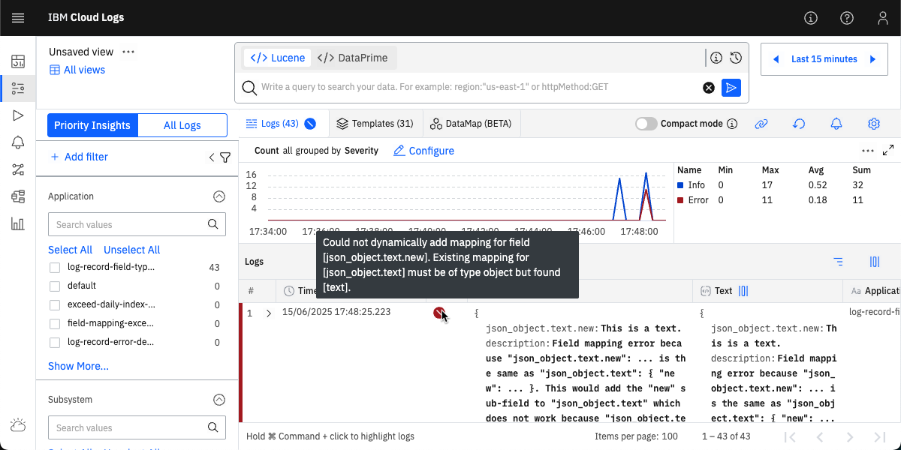
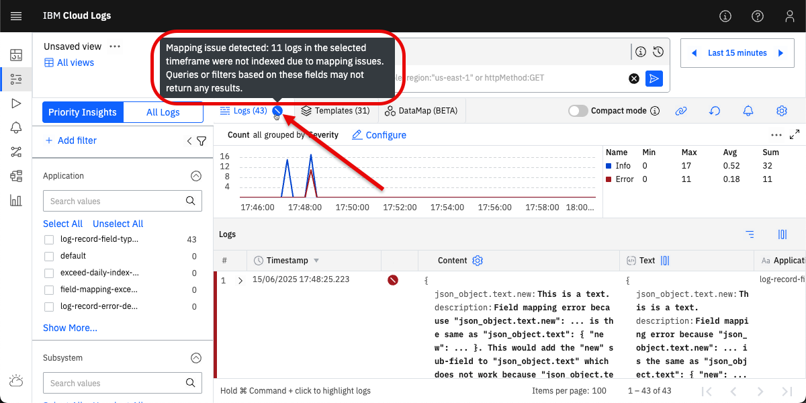
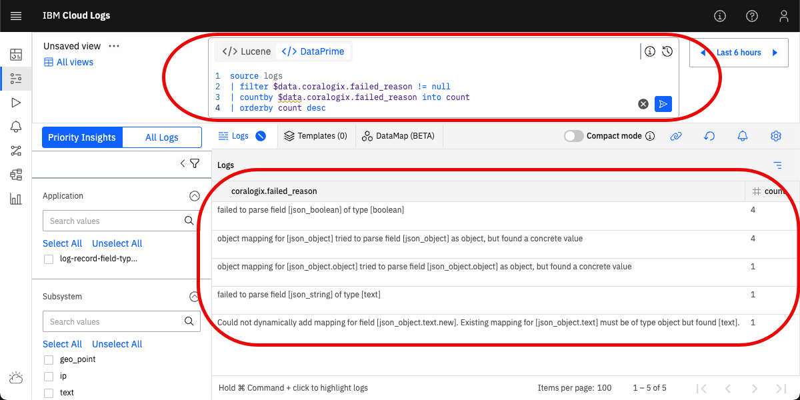

[SPDX-License-Identifier: CC-BY-SA-4.0]: #
[Copyright © 2024, 2025 Sven Lange-Last]: #
# Mapping Exceptions in IBM Cloud Logs Priority Insights



The **Priority insights** feature in IBM Cloud Logs parses log records into typed fields. By and large, the field types are not declared but dynamically inferred from field names and values when a field is processed for the first time.

Unfortunately, typed fields cause mapping exceptions when a log record field has a value that is inconpatible with the type inferred before. In such a case, **Priority insights** only stores the information of the full log record as text but not the individual fields. When you use filters or field-based searches in **Priority insights** on the **Logs** page, no log records affected by mapping exceptions will be returned. In this case, you might have the impression that log records are missing.

This article explains:

* what mapping exceptions in **Priority Insights** are.
* which field values are (in)compatible with which field types.
* what happens with a log record that has a mapping exception.
* whether log records affected by mapping exceptions are returned by searches.
* whether `geo_point`, `ip`, and `date` fields can have mapping exceptions.
* how to determine whether log records are affected by mapping exceptions - for example, by using the **Mapping exceptions** dashboard or DataPrime queries.
* how to read mapping exception messages.
* why mapping exceptions can vary from day to day.
* how to resolve mapping exceptions - in particular, by using parsing rules in IBM Cloud Logs.

The **Priority insights** feature is based on the [OpenSearch Project](https://opensearch.org/). If you already know OpenSearch, the concepts will sound familiar to you.

What is important to know: The **Store and search** feature in IBM Cloud Logs works differently than **Priority insights**. **Store and search** uses dynamic types and is not affected by mapping exceptions. If you miss log records in **Priority insights** searches, use the same query in **All Logs** on the **Logs** page. The **Store and search** feature requires that you connect an IBM Cloud Object Storage (COS) bucket to your IBM Cloud Logs service instance.

## Background

This section briefly reviews the key background information needed to understand mapping expectations in **Priority insights**. Article [Log Record Field Types in IBM Cloud Logs Priority Insights](https://github.com/sven-lange-last/cloud-logs/tree/main/priority-insights/log-record-field-types) provides all background information in deep detail.

If you already understand the following, you can skip this section:

* how **Priority insights** detects new fields and determines their type.
* what the relevant field types for mapping exceptions are: `object`, `boolean`, `text`.
* how arrays are processed.
* how the daily index works.
* how nested objects and dots (`.`) in field names work.

### Parsing log records into fields

Log records sent to IBM Cloud Logs can be text in many different formats. If a log record is in [JSON](https://www.json.org/) format, its JSON members are parsed into named fields together with their contents. If a log record is NOT in JSON format or mixed with non-JSON data, [parsing rules](https://cloud.ibm.com/docs/cloud-logs?topic=cloud-logs-log_parsing_rules) can be used in IBM Cloud Logs to transform the log record into JSON format that can be parsed. Parsing rules can also be used to extract portions of the log record into named fields.

### New fields and field types

**Priority insights** keeps track of all known fields in its index. When a log record is processed, **Priority insights** checks whether the field names are already known. For an unknown field, a field mapping is added to the index that determines the field type plus other instructions how to index the field. This field mapping depends on the field **value** and the field **name**.

After unknown fields have been added to the index, field values from the log record are indexed for fast field-based and full-text search. In addition, the full log record is stored.

The table below shows a subset of the field mapping rules in **Priority insights** at the time of writing this article that are relevant to understand mapping exceptions. When a new field is detected, **Priority insights** evaluates field mapping matching conditions from top to bottom. The first field mapping that matches the new field is added to the index.

Rank | Field value has type | Resulting field type | Example values
--- | --- | --- | ---
2 | `object` | [`object`](https://opensearch.org/docs/latest/field-types/supported-field-types/object/) |  `"new": { "key": "value" }`<br/>`"new": { }`
3 | `boolean` | [`boolean`](https://opensearch.org/docs/latest/field-types/supported-field-types/boolean/) | `"new": true`<br/>`"new": false`
6 | Any | [`text`](https://opensearch.org/docs/latest/field-types/supported-field-types/text/) | `"new": "This is a text."`<br/>`"new": "true"`<br/>`"new": 42`<br/>`"new": "48.666234,9.0366981"`<br/>`"new": "203.0.113.42"`<br/>`"new": "2024-09-17T16:39:30"`

In **Priority insights**, a log record field with JSON array value is stored as a field with multiple values. What is important: All values in the array must have the same type. Example: Field `"json_number_integer": [23, 42]` is stored as `text` field with two values, i.e. `23` and `42`.

### Daily indices

As mentioned above, **Priority insights** processes log records and stores them in the index as a set of fields and their contents.

Each IBM Cloud Logs service instance has a separate set of **Priority insights** indices. The first index in the set is created when the service instance is created. Once a day, a new index is created and added to the set. At the same time, the oldest index is removed if it has reached its expiration date.

A new daily index only contains field mappings for pre-defined label and metadata fields. Every day, all other fields in the index are learnt anew from the processed log records. As a result, field mappings in daily indices can differ if processed log records differ.

Queries in **Priority insights** work on the full set of indices that belong to the service instance - not only the current daily index.

The advantage of the daily index lifecycle: **Priority insights** does not keep inferred field types *forever*. If you change field types in your log records, the system will learn the new type with the next daily index.

### Nested objects

In **Priority insights**, a log record field with JSON object value is stored in the index as an `object` field. Similar to a JSON object, an `object` field contains an unordered set of sub-fields with values. Any JSON member in a JSON object creates a sub-field. In queries, a sub-field is referenced by using a [path expression](https://en.wikipedia.org/wiki/Path_expression) with dots (`.`).

Sub-fields of an `object` field can also have type `object`. As a result, `object` fields can be nested to (almost) any depth. Path expressions with dots are used to reference nested fields in queries. Example: `"an": {"object": {"nested:" {"in": {"an": "object"} } } }`. In this example, the innermost field named `an` is a `text` field and can be referenced as `an.object.nested.in.an`. All other fields are `object` fields.

**Priority insights** interpretes field names containing dots in received log records as path expressions. Such field names are expanded as nested objects when ingesting log records. Example: `"an.object.nested.in.an": "object"` is interpreted as `"an": {"object": {"nested:" {"in": {"an": "object"} } } }`. With this approach, path expressions in field names have the same meaning when ingesting and when querying.

### Challenges with dots in field names

Log records may contain field names with dots without being path expressions describing nested objects. Example: [Kubernetes Recommended Labels](https://kubernetes.io/docs/concepts/overview/working-with-objects/common-labels/) or [Kubernetes Well-Known Labels, Annotations and Taints](https://kubernetes.io/docs/reference/labels-annotations-taints/) contain dots (`.`). Widely used labels are `app.kubernetes.io/name`, `app.kubernetes.io/version`, `kubernetes.io/os`. Log collectors may add these labels and their values to log records when tailing container logs in a Kubernetes cluster.

When **Priority insights** processes a log record with field `"app.kubernetes.io/name": "test"`, it will be added to the index as `"app": { "kubernetes": { "io/name": "test" } }` - i.e. `object` fields `app` and `kubernetes` as well as `text` field `io/name`. Most users would have expected a single `text` field named `app.kubernetes.io/name`.

## What are mapping exceptions in Priority Insights?

As mentioned before, **Priority insights** parses log records into named fields. All these fields have a field mapping in the index that determines the field type plus other instructions how to index the field.

When **Priority insights** processes a log record, some of the fields in the log record will already have a field mapping in the current daily index and others may be unknown. For known fields, the field mapping defines the field type. It can happen that the value of a field in a new log record is not a compatible value for the type defined by the field mapping.

Example: The index has a field mapping for field `known` of type `object`. A new log record contains field `known` with a JSON string value which is an incompatible value for type `object`.

When **Priority insights** is not able to index a field from a new log record because its value is incompatible with an existing field mapping, this is a mapping exception. When a mapping exception occurs during log record ingestion, **Priority insights** will not process and index the log record as usual. More details follow below.

What is important to understand: A single incompatible field value in a log record causes a mapping exception for the full log record - not only the field with the incompatible value.

## Compatible and incompatible field values

Following table shows whether a field's JSON value type is compatible with an existing field mapping when ingesting a new log record. When the JSON value type of a processed log record field is incompatible with the field type of the field mapping in the daily index, a mapping exception occurs.

Field type | JSON value type | Compatible | Comments
--- | --- | --- | ---
`object` | `object` | Yes | 
`object` | `string`<br/>`number`<br/>`true` / `false` | No |
`boolean` | `true` / `false` | Yes |
`boolean` | `string` | No | `string` value `"true"` coerced to `boolean` value `true`<br/>`string` values `"false"` and `""` coerced to `boolean` value `false`
`boolean` | `object`<br/>`number` | No | 
`text` | `string`<br/>`number`<br/>`true` / `false` | Yes |
`text` | `object` | No |

JSON `null` values are compatible with all field types.

JSON `array` values have the same compatibility as their JSON base value type because **Priority insights** does not have an array type but any field can have multiple values.

### Example: `object` and JSON `string` value

* The current daily index contains a field named `json_object` with type `object`.
* **Priority insights** processes a new log record with field `"json_object": "This is a text."`.
* **Priority insights** determines that the provided JSON `string` value `"This is a text."` is incompatible with an `object` field.
* **Priority insights** cannot index the new log record with the given `json_object` field and value because of a mapping exception.

### Example: `text` and JSON `object` value

* The current daily index contains a field named `json_string` with type `text`.
* **Priority insights** processes a new log record with field `"json_string": { "new": "This is a text." }`.
* **Priority insights** detects that a field named `json_string` already exists in the daily index an tries to add `new` as a sub-field. This fails because only `object` fields can have sub-fields but the existing `json_string` field has type `text`.
* **Priority insights** cannot index the log record with the given `json_string.new` field and value because of a mapping exception.

### Example: `text` and dots in field names

In sections [Nested objects](#nested-objects) and [Challenges with dots in field names](#challenges-with-dots-in-field-names), I explained that field names with dots (`.`) will be interpreted as path expressions and will be expanded as nested objects. Log records may contain field names with dots that were never meant to be interpreted as path expressions. This can lead to a special case of a field mapping exception with nested fields that is hard to spot.

Example:

* The current daily index contains a field named `kubernetes.labels.app` with type `text`.<br/>The [IBM Cloud Logs Agent](https://cloud.ibm.com/docs/cloud-logs?topic=cloud-logs-agent-about) will add such a field to log records that were emitted by a container from a Kubernetes pod that has a label named `app`. Many Kubernetes workloads still use this label name because it was a de-facto standard label in the past and is still used in many Kubernetes examples. See [Kubernetes docs: Labels and Selectors](https://kubernetes.io/docs/concepts/overview/working-with-objects/labels).
* **Priority insights** processes a new log record with field `kubernetes.labels.app.kubernetes.io/name` that has a JSON string value.<br/>The IBM Cloud Logs Agent will add such a field to log records that were emitted by a container from a Kubernetes pod that has a label named `app.kubernetes.io/name`. This is a [well-known](https://kubernetes.io/docs/reference/labels-annotations-taints/#app-kubernetes-io-name) and [recommended](https://kubernetes.io/docs/concepts/overview/working-with-objects/common-labels/#labels) Kubernetes label.
* **Priority insights** detects that a field named `kubernetes.labels.app` already exists in the daily index and tries to add `kubernetes` as a sub-field. This fails because only `object` fields can have sub-fields but the existing `kubernetes.labels.app` field has type `text`.
* **Priority insights** cannot index the log record with the given `kubernetes.labels.app.kubernetes.io/name` field and value.

## What happens with a log record that has a mapping exception?

When a log record is affected by a mapping exception, **Priority insights** will do the following:

* The log record is NOT stored and indexed by **Priority insights** as-is.
* The original log record content is transformed into escaped JSON and stored in field named `text` in a transformed log record. As a result, it does no longer have named fields but is a single text string.
* A field mapping exception message is added to the transformed log record using the `coralogix.failed_reason` field. This field can be queried to find log records that could not be stored and indexed as-is.
* The transformed log record is indexed and stored by **Priority insights**. As a result, full-text search can still be performed - but no field-based searches.

What is important to understand: A mapping exception affects processing of the whole log record and all its fields - not only the field with the incompatible value. None of the fields will be indexed as usual.

Example:

* **Priority insights** processes a new log record with a single field: `{ "json_object": {} }`.
* **Priority insights** detects that `json_object` is a new field of type `object` and adds it to the daily index.
* **Priority insights** processes a new log record with a single field: `{ "json_object": "This is a text." }`.
* **Priority insights** detects that `json_object` is a known field of type `object`. The provided JSON string value `"This is a text."` is incompatible with this type.
* **Priority insights** wraps the full original log record as follows: `{ "text": "{\"json_object\":\"This is a text.\"}" }`. `json_object` is no longer a field in the log record, but only text. Full-text searches will still work on the wrapped log record.
* **Priority insights** adds following field to the log record: `"coralogix.failed_reason": "object mapping for [json_object] tried to parse field [json_object] as object, but found a concrete value"`.
* **Priority insights** indexes fields `text` and `coralogix.failed_reason` and stores the transformed log record.

## Are log records affected by mapping exceptions returned by searches?

Following searches in **Priority insights** will return log records affected by mapping exceptions:

* Filters or searches on log records label fields like `Application` or `Subsystem`.<br/>In Lucene queries, such fields are prefixed with `coralogix.`.<br/>In DataPrime queries, such fields are prefixed with `$l.`.
* Filters or searches on log record metadata fields like `Severity` (`severity`).<br/>In Lucene queries, such fields are prefixed with `coralogix.`.<br/>In DataPrime queries, such fields are prefixed with `$m.`.
* Full-text searches on log record data.<br/>Use Lucene queries like `"This is a text"`.<br/>Use Dataprime queries like `source logs | filter $d ~~ 'This is a text'`.

Filters or searches on log record data fields will NOT return log records affected by mapping exceptions. In Lucene queries, these are all fields not prefixed with `coralogix.`. In DataPrime queries, such fields are prefixed with `$d.`.

What is important to know: The **Store and search** feature in IBM Cloud Logs works differently than **Priority insights**. **Store and search** uses dynamic types and is not affected by mapping exceptions. If you miss log records in **Priority insights** queries, use the same query in **All Logs** on the **Logs** page. The **Store and search** feature requires that you connect an IBM Cloud Object Storage (COS) bucket to your IBM Cloud Logs service instance.

## Can `geo_point`, `ip`, and `date` fields have mapping exceptions?

In addition to `object`, `boolean`, and `text` fields, **Priority insights** also supports `geo_point`, `ip`, and `date` fields. From a mapping exception perspective, these fields are different because their field mappings ignore malformed values. When a log record contains a field with a malformed - i.e. incompatible - value and that field is configured to ignore malformed values, that field won't be indexed for the log record and NO mapping exception will occur. The problem will be silently ignored.

More details can be found in article [Log Record Field Types in IBM Cloud Logs Priority Insights](https://github.com/sven-lange-last/cloud-logs/tree/main/priority-insights/log-record-field-types).

## How can I determine whether log records are affected by mapping exceptions?

There are several approaches to determine whether log records are affected by mapping exceptions and which fields cause the mapping exceptions.

### Mapping exception indicator on **Logs** tab selector

On the **Explore Logs** - **Logs** page, select **Priority Insights**. The **Logs** tab selector is followed by a number in parentheses (`(...)`) with the number of logs that are matched by the current filter / query combination. If that tab selector also contains an indicator symbol that looks like a filled crossed-out circle, the result list contains log records affected by mapping exceptions. If you hover the mouse pointer over the indicator symbol, IBM Cloud Logs will display a help message.



### Exclamation mark (`!`) column

On the **Explore Logs** - **Logs** page, select **Priority Insights** and the **Logs** tab. If the result list contains log records affected by mapping exceptions, you can add a result column named `!` (exclamation mark) which displays the contents of the `coralogix.failed_reason` field. For log records affected by mapping exceptions, the `!` columns will contain an indicator symbol that looks like a filled crossed-out circle. If you hover the mouse pointer over the indicator symbol, Cloud Logs will display the mapping exception message.

Select **Columns** to add `!` (exclamation mark) column.


Move the `!` (exclamation mark) column to `In use` list.


Sample mapping exception message for a log record in `!` (exclamation mark) column.


### Mapping Exceptions dashboard

IBM Cloud Logs comes with the `System Monitoring for IBM Cloud Logs` extension that provides a `Mapping Exceptions` dashboard.

#### Deploy `Mapping Exceptions` dashboard

* Open the **Extensions** page.
* Search for the `System Monitoring for IBM Cloud Logs` extension.
* Click said extension to display details and deploy it.
* `Version` dropdown: Select latest vserion.
* `Applications` dropdown: Select `All Applications`.
* `Subsystems` dropdown: Select `All subsystems`.
* By default, all dashboards are pre-selected for deployment. Select at least the `Mapping Exceptions` dashboard.
* Click `Deploy` action.
* Confirm deployment.


#### Open and use `Mapping Exceptions` dashboard

* Open **Custom dashboards** page.
* Locate `System Monitoring` folder and open it.
* In said folder, locate `Mapping Exceptions` dashboard and open it.

At the time of writing this article, the `Mapping Exceptions` dashboard is used as follows:

* The dashboard is based on logs in **Priority insights** that belong to the selected time interval and that match the `Application` and `Subsystem` filters.
* `Number of Mapping Exceptions` widget: Displays the total number of log records affected by mapping exceptions.
* `Mapping Exceptions Failed Reasons` widget (top right): Displays a pie chart with different mapping exception failure messages.
* `Mapping Exceptions Failed Reasons` widget (middle): Displays a list of different mapping exception failure messages with frequency.
* `Logs with Mapping Exceptions` widget: Displays a list of log records affected by mapping exceptions.


### DataPrime queries

#### List mapping exceptions

Use following DataPrime query in **Priority Insights** to identify which field mapping exceptions occur how often. IBM Cloud Logs will display a result table. Resize the `coralogix.failed_reason` column to see the full exception messages.

```
source logs
| filter $data.coralogix.failed_reason != null
| countby $data.coralogix.failed_reason into count
| orderby count desc
```



#### List log records affected by mapping exceptions

Use following DataPrime query in **Priority Insights** to list log records affected by a field mapping exception:

```
source logs
| filter $data.coralogix.failed_reason != null
| choose $data.text, $data.coralogix.failed_reason
```

#### List log records affected by a specific mapping exception

Use following DataPrime query in **Priority Insights** to list log records that are affected by a particular mapping exception - replace `<failed_reason>` in `contains()` with the mapping exception message. The query returns the `text` field and the `coralogix.failed_reason` of matching log records.

```
source logs
| filter $data.coralogix.failed_reason.contains('<failed_reason>')
| choose $data.text, $data.coralogix.failed_reason
```

#### List log records NOT affected by a specific mapping exception

When creating parsing rules to address mapping exceptions, it is often useful to see log records with the field in question that are not affected by a mapping exception. Use following DataPrime query in **Priority Insights** to list such log records - replace `<field_name>` with the name of the field in question.

```
source logs
| filter $data.coralogix.failed_reason == null
| filter $data.<field_name> != null
| choose $data.<field_name>
```

## How do I read mapping exception messages?

Mapping exception messages always contain

* the field affected by the exception: `field [...]`. The square brackets contain the field name.
* the exception reason.

The following table lists and explains typical mapping exception messages.

Mapping exception message | Explanation
--- | ---
`failed to parse field [<field-name>] of type [<type>]` | The log record contains a field `<field-name>`. The daily **Priority insights** index already contains a field with the type mentioned in the message. The field value in the log record is not compatible with the field type registered in the index.<br/>This message can occur with types `boolean` and `text`.
`object mapping for [<field-name>] tried to parse field [<field-name>] as object, but found a concrete value` | The log record contains a field `<field-name>`. The daily **Priority insights** index already contains an `object` field with that name. The field value in the log record is not an object.
`Could not dynamically add mapping for field [<field-name>.<sub-field-name>]. Existing mapping for [<field-name>] must be of type object but found [<type>].` | The log record contains a field `<field-name>.<sub-field-name>`. The daily **Priority insights** index already contains a field with name `<field-name>` which is not of type `object`. Said index does NOT contain a field with name `<field-name>.<sub-field-name>` yet. **Priority insights** wants to add field `<sub-field-name>` as a sub-field to the known field `<field-name>` which does not work because sub-fields can only be added to `object` fields.<br/>This message occurs most often if `<field-name>` is already known as `text` field.

## Mapping exceptions can vary from day to day

As mentioned before, **Priority insights** maintains a separate daily index for each IBM Cloud Logs service instance. Every day a new daily index is created. After creation, the new daily index only contains field mappings for pre-defined label and metadata fields. Every day, all other fields are learnt anew and new field mappings are added. Daily indices are independent of each other and a particular field name can have a different type every day.

Mapping exceptions are caused by fields that have different types in different log records. The log record that has the first occurrence of a particular field `F` on a day determines the field type *T1* on this day. Other log records on that day may contain field `F` with type *T2*. On that day, log records where field `F` has type *T2* will be affected by a mapping exception. The next day, the first log record with field `F` could be one where field `F` has the type *T2*. On that day, log records where field `F` has type *T1* will be affected by a mapping exception. Mapping exceptions related to a particular field can vary from day to day.

Example:

* Some log records contain a field named `message` with values that **Priority insights** classifies as `text`.
* Other log records contain a field named `message` with object values, i.e. the `message` field has sub-fields.
* **Priority insights** stores known fields and their types in the daily index. Whether `message` is a `text` field or an `object` field in the daily index depends on which log record is processed first on a day.
* If `message` is indexed as a `text` field, log records that contain `message` as an `object` field will have following mapping exception message: `Could not dynamically add mapping for field [message...]. Existing mapping for [message] must be of type object but found [text].`.
* If `message` is indexed as a `object` field, log records that contain `message` as an `text` field will have following mapping exception message: `object mapping for [message] tried to parse field [message] as object, but found a concrete value`.

## How do I resolve mapping exceptions?

The generic answer is to ensure that all values of a particular log record field always have the same type in **Priority insights**. Once **Priority insights** has determined the type of a field and added it to a daily index, all following log records must only have allowed values for that type.

This can be done at different places with different approaches:

* Curate log messages / records emitted by applications such that a particular field always has the same type. There are standard schemas for log record field names and types like the [Elastic Common Schema (ECS)](https://www.elastic.co/docs/reference/ecs) or [OpenTelemetry semantic conventions](https://opentelemetry.io/docs/specs/semconv/) that prevent mapping exceptions.
* Use filters in the [IBM Cloud Logs Agent](https://cloud.ibm.com/docs/cloud-logs?topic=cloud-logs-agent-about) to transform field names or field values. See [IBM Cloud Logs documentation: Available filter plug-ins](https://cloud.ibm.com/docs/cloud-logs?topic=cloud-logs-agent-plugin-support#filter-plugins-available).
* Use parsing rules in IBM Cloud Logs to transform field names or field values. See [IBM Cloud Logs log parsing rules](https://cloud.ibm.com/docs/cloud-logs?topic=cloud-logs-log_parsing_rules).

This article focuses on parsing rules in IBM Cloud Logs.

What it is important:

* A log record may be affected by multiple mapping exceptions - but only one mapping exception message is available on an affected log record. After a mapping exception has been resolved, additional mapping exception messages may become visible. Resolving mapping exceptions is an iterative process.
* The approaches listed above only affect new log records. When you add a parsing rule to IBM Cloud Logs, it won't change log records that are already stored in **Priority insights** or **Store and search**. Log records already stored in **Priority insights** that were affected by a mapping exception before a parsing rule was added will still be affected by the same mapping exception after the parsing rule was added.
* The approaches listed above cannot change existing field mappings in the current daily **Priority insights** index. The current daily index may still contain undesired field mappings so that more log records to be stored in this index will be affected by mapping exceptions. You may have to wait for a new daily index to see the desired effect of the approaches listed above.<br/>Example: If you rename an `object` field to resolve a conflict with a `text` field, this field will still be an `object` field in existing indices. A new daily index is needed to turn it into a `text` field.

## Use parsing rules in IBM Cloud Logs to resolve mapping exceptions

There are different techniques to resolve mapping exceptions with parsing rules in IBM Cloud Logs:

1. Change log record field name: Use a [**Replace** parsing rule](https://cloud.ibm.com/docs/cloud-logs?topic=cloud-logs-parse-replace-rule) to detect a field with a value that has a conflicting type and rename the field.
2. Sanitize field names with dots: Use a [**Replace** parsing rule](https://cloud.ibm.com/docs/cloud-logs?topic=cloud-logs-parse-replace-rule) to detect a field name with dots (`.`) and replace dots with `_`.
3. Hide complex nested field object structures: Use a [**Stringify JSON field** parsing rule](https://cloud.ibm.com/docs/cloud-logs?topic=cloud-logs-parse-convert-to-json-string) to rename a field with a complex JSON object value and turn the value into escaped JSON.

The following sections describe the techniques in more detail.

### Regular expressions in parsing rules

[Regular expressions](https://en.wikipedia.org/wiki/Regular_expression) play a central role in parsing rules. They are used to match, capture, and replace log record content. Parsing rules and regular expressions can operate on the full log record content (`Text`) or on detected fields. When changing field names, you should always work on full log record content.

Regular expressions in parsing rules work on raw log record content. Mapping exceptions can only occur if log record content is in [JSON](https://www.json.org/) format - otherwise **Priority Insights** won't detect fields and field types. For this reason, regular expressions in parsing rules for resolving mapping exceptions will always operate on content in JSON format. Knowledge of the JSON format can be used to "detect" field types in regular expressions.

JSON value type | JSON value 
--- | ---
`object` | Starts with `{`
`string` | Starts with `"`
`number` | Starts with a digit or `-`
`boolean` | `true` or `false`

Always test regular expression matchers and replacement strings with a couple of sample raw log records. Use the approaches from section [How can I determine whether log records are affected by mapping exceptions?](#how-can-i-determine-whether-log-records-are-affected-by-mapping-exceptions) to identify sample log records for testing.

Use the following procedure to obtain a raw log record. On the **Explore Logs** - **Logs** page, the result list has a `#` column with consecutive number. Hover the mouse pointer over the number of the log record for which you want to obtain the raw content until it turns into three dots (`...`). Click the three dots to open a context menu and select **Open Info Panel**. In this panel, select option **RAW** and use the **Copy to clipboard** button.

Creating a proper regular expression can be challenging. You can use tools like https://regex101.com/ to create, test, and debug regular expressions as well as replacement strings.

See [Building RegEx expressions](https://cloud.ibm.com/docs/cloud-logs?topic=cloud-logs-parse-rules-regex) for more information which regular expression features are supported by IBM Cloud Logs.

After a parsing rule has been set up, check whether new log records look as expected and whether they are no longer affected by mapping exceptions.

### Technique 1: Change log record field name

Use a [**Replace** parsing rule](https://cloud.ibm.com/docs/cloud-logs?topic=cloud-logs-parse-replace-rule) to detect a field with a value that has a conflicting type and rename the field. The regular expression used by the parsing rule needs to match the field name AND values with conflicting type so that the field name is only changed on the proper set of log records.

Problem: **`field` has JSON object values and other JSON type values**

* Solution: Rename from `field` to `field_obj` for JSON object values.
* Procedure: JSON object values always start with the `{` character. Capture field name as well as following content using a capture group (`()`) to build replacement string.
* Regular expression: `"(field)"(\s*:\s*{)`
* Replacement string: `"$1_obj"$2`
* Sample logs and results:
  * `"field": {}` ⇨ `"field_obj": {}`
  * `"field" : ""` ⇨ `"field" : ""`
  * `"field":1` ⇨ `"field":1`
* Regex101 Link: https://regex101.com/r/kZ4kjw/2

Problem: **`field` has JSON string and other JSON type values**

* Solution: Rename from `field` to `field_text` for JSON string values.
* Procedure: JSON string values always start with the `"` character. Capture field name as well as following content using a capture group (`()`) to build replacement string.
* Regular expression: `"(field)"(\s*:\s*")`
* Replacement string: `"$1_text"$2`
* Sample logs and results:
  * `"field": {}` ⇨ `"field": {}`
  * `"field" : ""` ⇨ `"field_text" : ""`
  * `"field":1` ⇨ `"field":1`
* Regex101 Link: https://regex101.com/r/vhyYNy/1

### Technique 2: Sanitize field names with dots

Use a [**Replace** parsing rule](https://cloud.ibm.com/docs/cloud-logs?topic=cloud-logs-parse-replace-rule) to detect a field name with dots (`.`) and replace dots with `_` to prevent interpretation as path expression and expansion as nested object in **Priority insights**. The regular expression used by the parsing rule needs to match fields to avoid replacement of field values.

Problem: **Field name contains dots (`.`)**

* Solution: Replace dots (`.`) in field names with `_`.
* Procedure: JSON field names are enclosed in `"` and follow after `{` (first name / value pair) or `,` (second to n-th name / value pair). Field names are followed by `:`. Capture characters before and after field name to build replacement string. Important: Dots (`.`) in regular expressions need to be escaped - otherwise they will match any single character.
* Regular expression: `([{,]\s*)"field\.with\.dots"(\s*:)`
* Replacement string: `$1"field_with_dots"$2`
* Sample log: `{ "field.with.dots": "", "field-with-dots" : "field.with.dots", "field.with.dots":"" }`
* Sample result: `{ "field_with_dots": "", "field-with-dots" : "field.with.dots", "field_with_dots":"" }`
* Regex101 Link: https://regex101.com/r/dzOrAF/2

Problem: **Kubernetes labels prefixed with `app.kubernetes.io/` in field names potentially cause mapping exceptions**

* Solution: Replace Kube label prefix `app.kubernetes.io/` with `app_kubernetes_io_` in field names.
* Procedure: JSON fields `kubernetes.labels` or `labels` contain a comma separated list of Kubernetes labels as name / value pairs. These field names may contain `app.kubernetes.io/` as prefix. Capture characters before and after field name prefix to build replacement string.
* Regular expression: `([{,]\s*")app\.kubernetes\.io\/([^"]+"\s*:)`
* Replacement string: `$1app_kubernetes_io_$2`
* Sample log: `{ "kubernetes": { "labels": { "app.kubernetes.io/name": "name", "app.kubernetes.io/version": "1.2.3", "no-match-field": "app.kubernetes.io/name" } } }`
* Sample result: `{ "kubernetes": { "labels": { "app_kubernetes_io_name": "name", "app_kubernetes_io_version": "1.2.3", "no-match-field": "app.kubernetes.io/name" } } }`
* Regex101 Link: https://regex101.com/r/dyGEZI/2

### Technique 3: Hide complex nested field object structures

Use a [**Stringify JSON field** parsing rule](https://cloud.ibm.com/docs/cloud-logs?topic=cloud-logs-parse-convert-to-json-string) to rename a field with a complex JSON object value and turn its value into escaped JSON. **Priority insights** only parses values in JSON format into named fields with content but not escaped JSON. With the parsing rule, the transformed field is no longer an `object` field but a `text` field. **Priority insights** will no longer parse the former complex JSON object value into nested fields. Content of the transformed field won't work any longer with filters or field-based queries but can still be searched with full-text queries.

This approach is useful for complex log records in JSON format where most of the nested fields will rarely be used in filters or field searches.

There are standard log formats based on JSON with standard fields the values ​of which ​can be set freely by the application emitting a log record. For such free-use fields, there is a high chance that different applications emitting logs in such a format use the same nested field names below free-use fields but use different value types. This will cause mapping exceptions in Priority insights.

Example: IBM Cloud Activity Tracker [events](https://cloud.ibm.com/docs/atracker?topic=atracker-event) have [requestData](https://cloud.ibm.com/docs/atracker?topic=atracker-event#requestData) and [responseData](https://cloud.ibm.com/docs/atracker?topic=atracker-event#responseData) fields that have JSON object values. IBM Cloud services emit audit events whenever their API is invoked and said fields are supposed to contain requests to the API as well as the response from the API. Different services can have API requests and responses that use the same JSON field names but with different values type. This leads to mapping exceptions in Priority insights.

Problem: **Different field types in complex nested log record field structure cause mapping exceptions**

* Solution: Transform complex JSON object values rarely used in field searches into escape JSON.
* Procedure: With `Stringify JSON field` parsing rules, fields with values in JSON format can be renamed and turned into escaped JSON format that is no longer parsed into named fields by Priority insights.
* Source field: Select the field that you want to transform.
* Delete the source field - don't keep it.
* Destination field:
  * The destination field should be named differently than the source field - in particular, if you use a rule matcher that applies the parsing rule only to a subset of log records. The destination field will be a `text` field. So you may want to append `Text` or `_text` to the original field name.
  * The parsing rule editor may recognize that the specified destination field is not known yet. It will show `Add item "..."` below the destination field name input field. Click on `Add item "..."` to confirm the new field.
  * Example: If the source field is named `requestData`, you may use `requestDataText` as destination field name.

Example:

* Transform the top level `.an` field in `{ "an": {"object":{"nested:"{"in":{"an":"object"}}}} }` and rename it to `a_text`.
* Result: `{ "a_text": "{\"object\":{\"nested:\"{\"in\":{\"an\":\"object\"}}}}" }`
